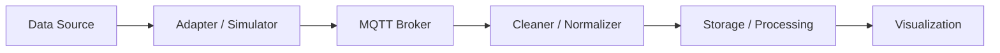
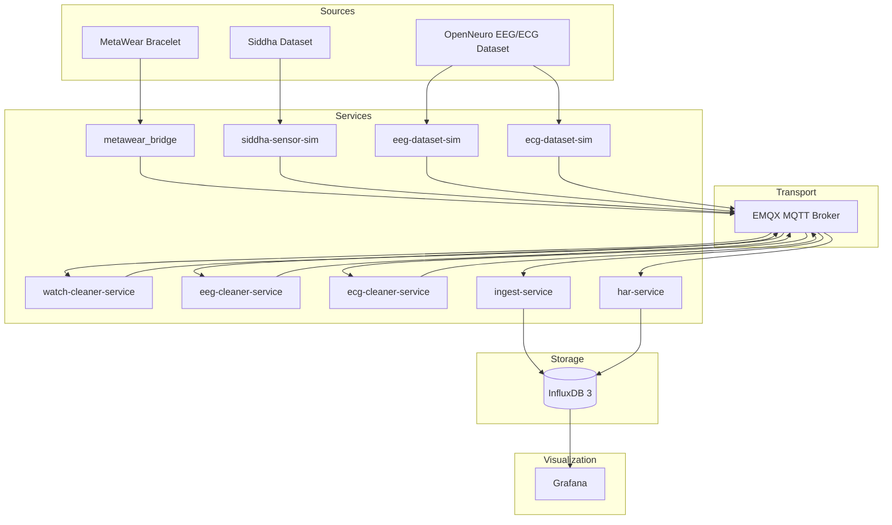
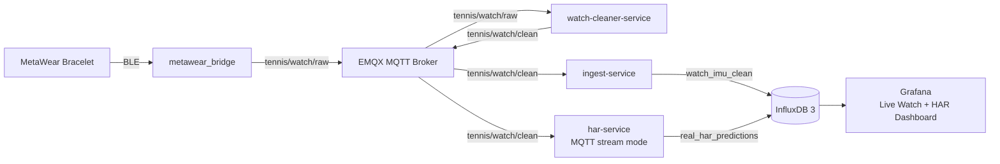
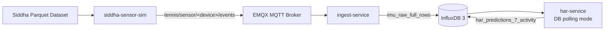
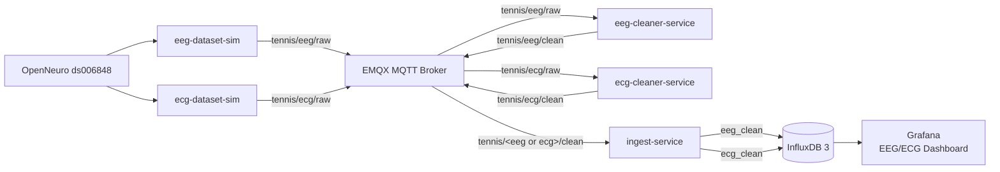

# Smart Tennis Field — IoT Sensor Pipeline + Live HAR

Smart Tennis Field is a Docker-based IoT thesis project for collecting, cleaning, storing, processing, and visualizing wearable and dataset-based sensor streams. It validates a microservice architecture for MetaWear watch ingestion, ONNX human activity recognition (HAR), Siddha dataset replay, EEG/ECG dataset fake sensors, InfluxDB storage, and Grafana visualization.

## Phase Status

| Phase | Status | Result |
|---|---|---|
| Phase 0 | Completed | EMQX MQTT broker validated |
| Phase 1 | Completed | Ingest-service and InfluxDB storage |
| Phase 2 | Completed | Siddha dataset replay stored in InfluxDB |
| Phase 3 | Completed | ONNX HAR service with DB polling mode |
| Phase 4 | Completed | Real MetaWear watch pipeline and live HAR |
| Phase 5 | Completed | Grafana dashboard from InfluxDB |
| Phase 6 | Completed | EEG/ECG dataset fake sensors and storage |

## Architecture

The project follows a modular IoT pipeline:



## Implemented Data Flows


### Final Validated System



The final system supports both real hardware data and dataset-based replay. All clean sensor data is stored by the ingest-service, while HAR predictions are produced and stored by the HAR service.


### Real Watch + HAR



### Siddha Dataset Replay



### EEG/ECG Fake Sensors



## Services

| Service | Purpose |
|---|---|
| `emqx` | MQTT broker |
| `influxdb3` | Time-series database |
| `influxdb3-explorer` | InfluxDB web UI |
| `ingest-service` | Stores clean sensor data |
| `siddha-sensor-sim` | Replays Siddha IMU dataset |
| `metawear_bridge` | Local BLE-to-MQTT adapter for MetaWear |
| `watch-cleaner-service` | Cleans and pairs watch ACC/GYRO rows |
| `har-service` | Runs ONNX HAR inference |
| `grafana` | Visualizes stored sensor and prediction data |
| `eeg-dataset-sim` | Replays EEG samples from OpenNeuro |
| `eeg-cleaner-service` | Validates and normalizes EEG rows |
| `ecg-dataset-sim` | Replays ECG samples from OpenNeuro |
| `ecg-cleaner-service` | Validates and normalizes ECG rows |

## Prerequisites

**System Requirements:**
- Docker Desktop and Docker Compose (latest versions)
- Python 3.11 or newer
- InfluxDB token (for data persistence)
- 8+ GB RAM available to Docker

**Optional Hardware:**
- MetaWear bracelet (for Phase 4 live watch pipeline)
- OpenNeuro ds006848 dataset (for Phase 6 fake sensors)

## Quick Start

**Step 1: Create environment file**

```bash
cp .env.example .env
```

On Windows PowerShell:

```powershell
Copy-Item .env.example .env
```

**Step 2: Configure .env**

Set at least the following variables in the `.env` file:

```env
INFLUX_TOKEN=YOUR_TOKEN_HERE
HAR_INFLUX_TOKEN=YOUR_TOKEN_HERE
```

For other variables, defaults are provided in `.env.example`.

**Step 3: Start core services**

```bash
docker compose up -d emqx influxdb3 influxdb3-explorer ingest-service grafana
docker compose ps
curl http://localhost:8000/health
curl http://localhost:8000/stats
```

The system is ready when all containers report `healthy` status.

## Run Live Watch + HAR

The validated live-watch configuration uses `HAR_INPUT_LAYOUT=accel_then_gyro`,
`HAR_SCORE_AGGREGATION=sum`, `HAR_TEMPORAL_PREPROCESS=none`, and
`HAR_LIVE_WATCH_PREPROCESSING=true`. The preprocessor converts acceleration to
m/s², angular velocity to rad/s, interpolates to 20 Hz, and aligns a left-wrist
board with model coordinates as `X=-Y, Y=X, Z=Z`. The mapping was selected from
all 24 proper rotations using labeled typing and writing trials. Stored raw watch
rows remain unchanged. Configuration changes require recreating `har-service`.

The supplied original inference engine's `[40, 1, 7]` handling uses only the
first time step. Some captured windows have all-zero scores at that step, so the
live configuration aggregates the full 40-step output with `sum`.

For low latency, live inference uses `HAR_LIVE_WINDOW_STRIDE=1`: after the
initial 40-sample window, every new 20 Hz sample produces an MQTT prediction.
The Current Activity and Current Confidence Grafana panels subscribe directly
to `tennis/watch/predictions`. Historical predictions are written to InfluxDB
asynchronously at `HAR_LIVE_PERSISTENCE_INTERVAL_SECONDS=1.0`.

Run preprocessing regression tests from the repository root:

```bash
PYTHONPATH=services/har_service python3 -m unittest discover -s services/har_service/tests -v
```

Start backend services:

```bash
docker compose up -d emqx influxdb3 influxdb3-explorer ingest-service watch-cleaner-service har-service grafana
```

Run the MetaWear bridge locally:

```bash
cd services/metawear_bridge
python -m venv .venv
.venv\Scripts\activate
pip install -r requirements.txt
python -m app.bridge
```

Check logs:

```bash
docker compose logs -f watch-cleaner-service
docker compose logs -f ingest-service
docker compose logs -f har-service
```

## Run Siddha Replay

Place the Siddha dataset at `dataset/data.parquet`, then run:

```bash
docker compose up -d emqx influxdb3 ingest-service
docker compose --profile replay up siddha-sensor-sim
```

Check stored rows:

```sql
SELECT COUNT(*) AS n FROM imu_raw_full_rows;
```

To run HAR against Siddha replay data, switch HAR to DB polling mode before starting `har-service`:

```env
HAR_INPUT_MODE=db_polling
HAR_PREDICTION_TABLE=har_predictions_7_activity
HAR_FILTER_DEVICE=watch
HAR_ALLOWED_ACTIVITY_GT=F,G,O,P,Q,R,S
```

## Run EEG/ECG Phase 6

Place the OpenNeuro dataset at `dataset/openneuro_ds006848/`.

```bash
python3 reset_phase6_tables.py
docker compose --profile phase6 build
docker compose --profile phase6 up -d eeg-cleaner-service ecg-cleaner-service
docker compose --profile phase6 up -d eeg-dataset-sim
docker compose --profile phase6 up -d ecg-dataset-sim
```

On Windows, use `python reset_phase6_tables.py` if `python3` is not available.

Check logs:

```bash
docker compose logs -f eeg-dataset-sim
docker compose logs -f ecg-dataset-sim
docker compose logs -f eeg-cleaner-service
docker compose logs -f ecg-cleaner-service
docker compose logs -f ingest-service
```

Expected default Phase 6 validation with 600 seconds at 100 Hz:

| Table | Expected rows |
|---|---:|
| `eeg_clean` | about 60,000 |
| `ecg_clean` | about 60,000 |

```sql
SELECT COUNT(*) AS n FROM eeg_clean;
SELECT COUNT(*) AS n FROM ecg_clean;
```

## Dashboards

| Tool | URL | Login |
|---|---|---|
| Grafana | `http://localhost:3000` | `admin` / `admin` |
| InfluxDB Explorer | `http://localhost:8888` | token from `.env` |

| Dashboard | Status |
|---|---|
| `Smart Tennis Field - Live Dashboard` | Provisioned at `services/grafana/dashboards/smart-tennis-live-dashboard.json` |
| `EEG/ECG Fake-Sensor Monitoring` | Query set is documented in `docs/Validation/phase6_eeg_ecg_validation_report.md`; no dashboard JSON is currently provisioned in this repo |

## API Endpoints

FastAPI documentation is available at:

```text
http://localhost:8000/docs
```

| Endpoint | Purpose |
|---|---|
| `GET /health` | Service and writer health |
| `GET /stats` | Row counts and ingest queue metrics |
| `GET /tables` | Configured InfluxDB table names |
| `GET /schema` | Table schemas |
| `GET /devices` | Known devices across sensor tables |
| `GET /sensors/imu` | Siddha dataset IMU rows |
| `GET /sensors/watch` | Real watch clean IMU rows |
| `GET /sensors/eeg` | EEG fake-sensor rows |
| `GET /sensors/ecg` | ECG fake-sensor rows |

## Documentation

- [Documentation navigation](docs/NAVIGATION.md) - start here when looking for a specific document.
- [Architecture](docs/Architecture.md) - service boundaries, data flows, and storage ownership.
- [Dataset contract](docs/DatasetContract.md) - MQTT payloads, field meanings, and InfluxDB table design.
- [Phases](docs/Phases.md) - project chronology and implementation milestones.
- [Results](docs/Result.md) - validated outcomes, limits, and final thesis position.
- [Validation reports](docs/Validation) - phase-by-phase evidence.

## Scope

For the complete project scope and intentional limitations, see [Result.md §10](docs/Result.md#10-final-limitations).
